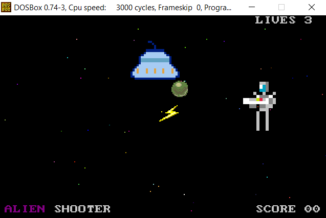

# Alien Shooter

Alien shooter is a game running in graphic mode on ms-dos system.

## Prerequisites

- Turbo C version 2.01
- Turbo Assembler version 2.01
- DOSBox or MS-DOS

TASM must be in the same folder as TC.

## How to compile
```bash
tcc -ml -B alien_sh.c
```

## Screenshot


## How to play
Your task is to stop an alien invasion by shooting at the UFO.\
The arrows are used to control your character (you can press 2 at the same time).\
X on the keyboard is used to shoot (UFO can shoot too).\
You must avoid ufo bullets as well as the spaceship itself.

That's basically it.

## Additional info
This game was made quickly just for fun and this is my first game for MS-DOS. The code is spaghetti-code, dirty and full of bad practices. 

## Resources
Start screen tentacle\
https://opengameart.org/content/tentacle-portrait [CC0](https://creativecommons.org/publicdomain/zero/1.0/)\
Author: blarumyrran@gmail.com

Lightning and ball images\
https://opengameart.org/content/rpg-ui-icons [CC0](https://creativecommons.org/publicdomain/zero/1.0/)\
Author: OwlishMedia

UFO\
https://opengameart.org/content/ufo-simple-and-cute [CC0](https://creativecommons.org/publicdomain/zero/1.0/)\
Author: Lazy Lazor

Font used in start screen\
https://opengameart.org/content/boxy-bold-font-split [CC0](https://creativecommons.org/publicdomain/zero/1.0/)\
Author: Clint Bellanger

Materials that were a great inspiration and allowed to create this game:\
http://www.brackeen.com/vga/\
http://www3.telus.net/alexander_russell/course/
